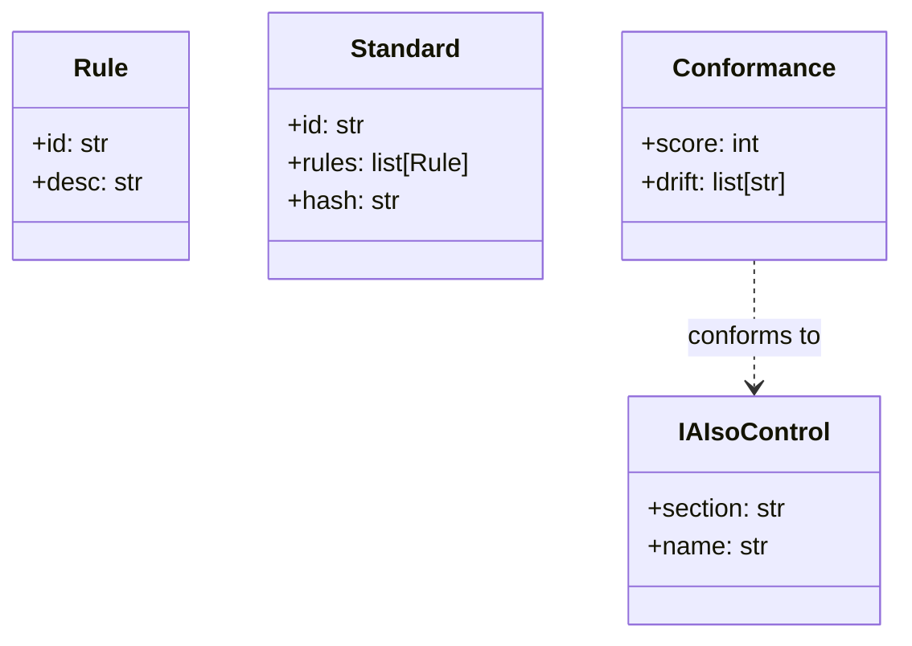

<!-- mcp-name: io.github.smarttasksorg/smartstandard · part of the Smart* family -->
<h1 align="center">🦔 SmartStandard</h1>
<p align="center"><b>Standardize before you scale. One shared, auditable convention for AI-assisted work.</b></p>
<p align="center">
  <a href="https://iaiso.org">IAIso §7 · Standards</a> ·
  <a href="https://smarttasks.cloud">SmartTasks.cloud</a> ·
  <a href="#part-of-the-smart-family">the Smart* family</a>
</p>

---

## Every teammate's AI output looks different. That's a problem at scale.

As AI reshapes how we work, a new gap opens: teams ship ai-assisted work with no shared, auditable standard. **SmartStandard** closes it —
`standardize` at the exact moment the gap bites, and it works the second you clone it
(a synthetic demo ships in `demo/`).

```bash
pip install smartstandard
smartstandard --demo        # run against the bundled demo
```

## Use it anywhere

The whole family (and its **IAIso starter kits**) covers Python, Node / TypeScript, Go, Java, PHP, Rust:

| You work in… | Do this |
|---|---|
| **Python** | `pip install smartstandard` |
| **Node / TypeScript** | `npx smartstandard-check .` |
| **Go** | `go run github.com/SmartTasksOrg/smartstandard/ports/go .` |
| **Java** | `java -jar smartstandard-check.jar .` |
| **PHP** | `php ports/php/smartstandard-check.php .` |
| **Rust** | `cargo run -p smartstandard-check .` |
| **AI coding tools** (Cursor, Claude, Cline, Windsurf, Zed) | add the MCP server: `{ "command": "smartstandard-mcp" }` |
| **CI / pre-commit** | drop in `.pre-commit-hooks.yaml` |

Starter kits for every language live in the **[IAIso repo](https://github.com/SmartTasksOrg/IAIso)** so you can
adopt the whole standard in the stack you already use.

## How it works

Rule IDs are namespaced `STD-*` so output looks kin to the rest of the family
(SmartPangolin's `SEC-*`, etc.). Deterministic, dependency-free, fail-loud.

### The data objects (UML)

These are real dataclasses in [`src/smartstandard/models.py`](src/smartstandard/models.py) — the
diagram and the code are the same thing:



## Where it sits in the architecture

SmartStandard doesn't stand alone — it stacks with the family, and everything conforms to
the IAIso standard — the same standard that governs SmartTasks' own apps, while each tool here stays standalone and drops into your architecture:


- **SmartStandard supplies rule sets to SmartPrompt** →
- **SmartStandard supplies rule sets to SmartCheck** →

Open [`site/playground.html`](site/playground.html) for the interactive version.

## Part of the Smart* family

One system, not nine projects — same mascot, same manifesto voice, same rule-ID style,
all aligned to the [IAIso standard](https://github.com/SmartTasksOrg/IAIso). Each is an independent, open-source, single-purpose tool you can integrate into your own architecture:

| Tool | IAIso | What it does |
|---|---|---|
| [SmartPangolin](https://github.com/SmartTasksOrg/smartpangolin) | §1 · Secure Sharing | Scan before you share. Stop leaking secrets into AI models, agents, and tools. |
| [SmartPrompt](https://github.com/SmartTasksOrg/smartprompt) | §4 · Context | Lint before you send. Bad prompt in, bad work out — and it's your name on it. |
| [SmartCheck](https://github.com/SmartTasksOrg/smartcheck) | §2 · Verification | Check before you sign off. Catch the AI when it's confidently wrong. |
| [SmartSeal](https://github.com/SmartTasksOrg/smartseal) | §3 · Provenance | Seal what you ship. A signed receipt so anyone can verify what they received. |
| [SmartSim](https://github.com/SmartTasksOrg/smartsim) | §8 · Foresight | Simulate before it hits you. See your role's task-by-task collapse sequence. |
| [SmartMoat](https://github.com/SmartTasksOrg/smartmoat) | §6 · Workforce | Know your moat. Score the tasks AI can't easily take — and widen them. |
| [SmartRoute](https://github.com/SmartTasksOrg/smartroute) | §5 · Orchestration | Route only what you trust. Gate agents and tools with trust scores and guardrails. |
| [SmartFeed](https://github.com/SmartTasksOrg/smartfeed) | §9 · Awareness | Distill the firehose. A tight brief of only what moves your work. |

**Backed by the standard:** SmartStandard implements **IAIso §7 · Standards**.
**Open-source edition:** this repo is the simplified, single-purpose version, built for any org to integrate into its own architecture. SmartTasks' desktop app and [SmartTasks.cloud](https://smarttasks.cloud) run a more advanced, deeply-integrated implementation of the same IAIso governance — a separate product, not this code bundled.

## Who's behind this

- **Roen Branham** — CEO & AI Strategy Architect · CISSP-certified AI, security & governance architect; author of IAIso and sole inventor of the Z4 Semantic Fabric patent application. [LinkedIn](https://www.linkedin.com/in/roen-branham-167ab29/)
- **Le Vu Tanh** — CTO & Core Engineering Lead · Chief architect of the Cortex engine; large-scale system reliability and low-latency infrastructure — the engineer who ships what gets architected. [LinkedIn](https://www.linkedin.com/in/lee-thanh-76aa8ba0/)

The team behind IAIso & SmartTasks: a CISSP-certified security & governance architect
and a large-scale systems engineer — 20+ years shipping secure, AI-driven platforms for
regulated, blue-chip environments (Allianz, BMW, Rolls-Royce, Heidenhain).

<!-- SMARTTASKS-MODELS:START -->
## Runs on governed local models

Every build ships **IAIso validation invariants** (pass/warn/fail) — a shared conformance baseline, like SmartStandard.

This tool is local-first, so pair it with models you can actually vet. **SmartTasks** publishes 21+ governance-validated GGUF builds on Hugging Face — each with a machine-readable **scorecard** (capability tiers L1 Layman → L5 Agentic, IAIso conformance invariants (pass/warn/fail), OWASP-mapped garak red-team, transparency probes (viewpoint-alignment / over-refusal), and per-file SHA-256). Gate model selection on evidence, not vibes — and every finding, including warnings, is published in full.

→ **[SmartTasks on Hugging Face](https://huggingface.co/smarttasks)** · [Qwen3.6-27B](https://huggingface.co/smarttasks/Qwen3.6-27B-GGUF) (L5 agentic) · [react-agent-coder-llama-3.1-8b](https://huggingface.co/smarttasks/react-agent-coder-llama-3.1-8b-GGUF) (agentic coder) · [gpt-oss-20b](https://huggingface.co/smarttasks/gpt-oss-20b-GGUF) (open reasoning)
<!-- SMARTTASKS-MODELS:END -->

## Get in touch

- **Companies & enterprises:** [enterprise@smarttasks.cloud](mailto:enterprise@smarttasks.cloud) — we help
  teams integrate SmartStandard + IAIso into their architecture so governance and
  audit-readiness become a byproduct of how they already work.
- **The standard:** [IAIso](https://github.com/SmartTasksOrg/IAIso) · [iaiso.org](https://iaiso.org)
- **The product:** [SmartTasks.cloud](https://smarttasks.cloud)

Built by **SmartTasks Lab**. Apache-2.0. Contributions welcome.
